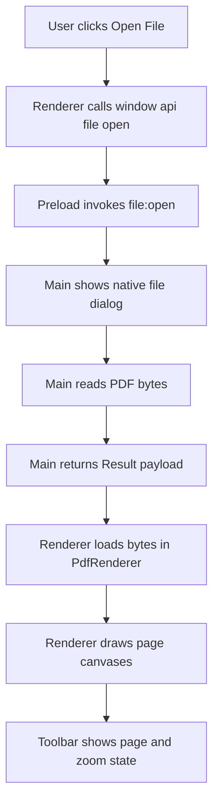

# PRP: pdf-viewer

## Goal

Deliver a **view-only PDF foundation** for Folio where users can open a local PDF, render pages in the center viewport, scroll through pages, zoom with wheel + toolbar controls, and see current page status.

### Success Criteria

1. User can click an Open File button and choose a `.pdf` file from the native OS picker.
2. PDF pages render correctly via `pdfjs-dist` through a dedicated wrapper.
3. User can scroll vertically through all pages.
4. User can zoom using toolbar steps `50%`, `75%`, `100%`, `125%`, `150%` and mouse wheel zoom behavior.
5. Toolbar shows `Page X / Y` and updates while scrolling.
6. Invalid or corrupted files show an error message and the app remains stable.
7. Opening a second file replaces the current document cleanly.

---

## Scope Decision

This PRP follows the approved **hybrid scope**:

- Build only the essential wrappers and stores needed for PDF viewing.
- Defer full App Shell and multi-feature registration framework to a later PRP.
- Do not add edit commands, undo/redo document mutations, or sidebar panels.

---

## Context to Load

Read these files before implementation:

1. `INITIAL.md`
2. `package.json`
3. `tsconfig.web.json`
4. `tsconfig.node.json`
5. `src/main/index.ts`
6. `src/preload/index.ts`
7. `src/preload/index.d.ts`
8. `src/renderer/src/App.tsx`
9. `src/renderer/src/main.tsx`
10. `src/renderer/src/assets/main.css`

Memory search preflight:

- `pdf-editor pdf-viewer`
- `pdf-editor pdf-viewer problem`

---

## Feature Anatomy

| Building Block | Needed | Notes |
|---|---:|---|
| `index.ts` feature registration | No | Deferred with full App Shell rollout |
| Canvas interaction mode | Minimal | Viewport scroll + wheel zoom only, no edit mode |
| Command | No | View-only feature, no PDF mutation |
| Sidebar panel | No | Not required in INITIAL |
| Dialog | No custom dialog | Uses OS file picker via main-process IPC |
| Core wrapper | Yes | Add `PdfRenderer` wrapper to isolate `pdfjs-dist` |
| Store slices | Yes | Add `documentStore` and `editorStore` for view state |

---

## Architecture Flow



---

## Data Model

Use concrete types; no placeholders.

```ts
export type Result<T, E = string> =
  | { ok: true; value: T }
  | { ok: false; error: E };

export const ok = <T>(value: T): Result<T> => ({ ok: true, value });
export const err = <E = string>(error: E): Result<never, E> => ({ ok: false, error });

export type ZoomLevel = 0.5 | 0.75 | 1 | 1.25 | 1.5;

export interface OpenPdfSuccess {
  filePath: string;
  fileName: string;
  bytes: Uint8Array;
}

export interface DocumentState {
  filePath: string | null;
  fileName: string | null;
  bytes: Uint8Array | null;
  pageCount: number;
  isLoading: boolean;
  loadError: string | null;
  openDocument: (doc: OpenPdfSuccess, pageCount: number) => void;
  setLoading: (isLoading: boolean) => void;
  setLoadError: (message: string | null) => void;
  closeDocument: () => void;
}

export interface EditorState {
  currentPage: number;
  scale: ZoomLevel;
  setCurrentPage: (page: number) => void;
  setScale: (scale: ZoomLevel) => void;
  zoomIn: () => void;
  zoomOut: () => void;
}

export interface RenderPageInput {
  canvas: HTMLCanvasElement;
  pageIndex: number;
  scale: number;
}

export interface PdfLoadInfo {
  pageCount: number;
}

export interface PdfRendererApi {
  load: (bytes: Uint8Array) => Promise<Result<PdfLoadInfo>>;
  renderPage: (input: RenderPageInput) => Promise<Result<void>>;
  dispose: () => void;
}
```

---

## File Structure

### Create

1. `src/main/ipc/fileOpen.ts`
2. `src/renderer/src/types/result.ts`
3. `src/renderer/src/types/pdfViewer.ts`
4. `src/renderer/src/core/PdfRenderer.ts`
5. `src/renderer/src/store/documentStore.ts`
6. `src/renderer/src/store/editorStore.ts`
7. `src/renderer/src/hooks/usePdfViewer.ts`
8. `src/renderer/src/components/pdf-viewer/WelcomeScreen.tsx`
9. `src/renderer/src/components/pdf-viewer/PdfToolbar.tsx`
10. `src/renderer/src/components/pdf-viewer/PdfViewport.tsx`
11. `src/renderer/src/components/pdf-viewer/PdfViewerScreen.tsx`
12. `src/renderer/src/assets/pdf-viewer.css`

### Modify

1. `package.json` add `pdfjs-dist`, `zustand`
2. `src/main/index.ts` register typed IPC handler
3. `src/preload/index.ts` expose typed `window.api.file.open`
4. `src/preload/index.d.ts` declare API contract for renderer
5. `src/renderer/src/App.tsx` replace boilerplate with viewer shell
6. `src/renderer/src/main.tsx` keep bootstrapping, ensure App import is valid
7. `src/renderer/src/assets/main.css` simplify global styles and import viewer styles

---

## Implementation Steps

### Step 1: Add dependencies

Install runtime packages:

```bash
npm install pdfjs-dist zustand
```

Keep existing toolchain unchanged.

---

### Step 2: Add IPC file-open handler in main process

Create `src/main/ipc/fileOpen.ts`:

- Use `dialog.showOpenDialog` with PDF file filter.
- Read bytes using `fs/promises` only in main process.
- Return `Result<OpenPdfSuccess>`.
- Handle cancel and I/O failures without throwing past handler boundary.

Integration in `src/main/index.ts`:

- Register with `ipcMain.handle` channel `file:open`.
- Keep existing `ping` example removable or retained as non-blocking.

Example handler shape:

```ts
ipcMain.handle('file:open', async (): Promise<Result<OpenPdfSuccess>> => {
  try {
    // open dialog, read bytes, return ok payload
  } catch (error: unknown) {
    // return err with normalized message
  }
});
```

---

### Step 3: Expose typed preload API

Update `src/preload/index.ts` to expose:

```ts
window.api.file.open(): Promise<Result<OpenPdfSuccess>>
```

Requirements:

- Use `ipcRenderer.invoke('file:open')` in preload.
- Keep `contextIsolation`-safe bridge via `contextBridge`.
- Update `src/preload/index.d.ts` so renderer gets full typing.

---

### Step 4: Implement renderer result and domain types

Create shared renderer-side types:

- `src/renderer/src/types/result.ts`
- `src/renderer/src/types/pdfViewer.ts`

Include concrete `ZoomLevel`, `DocumentState`, and API payload types.

---

### Step 5: Implement `PdfRenderer` wrapper

Create `src/renderer/src/core/PdfRenderer.ts` as the only location importing `pdfjs-dist`.

Responsibilities:

1. Configure PDF.js worker for Electron + Vite build output.
2. Load document bytes and cache PDF document handle.
3. Render individual pages to provided canvases at requested scale.
4. Cancel or ignore stale render tasks during rapid zoom/scroll updates.
5. Expose `dispose` to release references.

Rule:

- No direct `pdfjs-dist` calls outside this file.

---

### Step 6: Create state slices with Zustand

Create:

- `src/renderer/src/store/documentStore.ts`
- `src/renderer/src/store/editorStore.ts`

Constraints:

- Store actions update state only.
- No file I/O and no PDF rendering logic in store actions.
- Keep zoom values constrained to allowed levels.

---

### Step 7: Build viewer hook and UI components

Create orchestration hook `src/renderer/src/hooks/usePdfViewer.ts` that:

1. Calls `window.api.file.open`.
2. Loads selected bytes into `PdfRenderer`.
3. Initializes page count in stores.
4. Re-renders canvases when zoom changes.
5. Tracks current page from scroll position.
6. Handles error states and reset on second file open.

Create components:

- `WelcomeScreen.tsx` for first-launch no-document state.
- `PdfToolbar.tsx` with Open, Zoom Out, Zoom In, page indicator.
- `PdfViewport.tsx` for scroll container and canvases.
- `PdfViewerScreen.tsx` compose toolbar + viewport + error banner region.

---

### Step 8: Replace boilerplate App shell

Update `src/renderer/src/App.tsx`:

- Remove starter Electron demo content.
- Render `PdfViewerScreen`.
- Connect wheel zoom behavior and toolbar actions through `usePdfViewer`.

Wheel behavior recommendation for first implementation:

- Zoom only when modifier key is held, keep plain wheel for vertical scrolling.
- If product decision requires plain wheel zoom, implement throttled zoom and keep page scroll via scroll container APIs.

---

### Step 9: Styling and layout

Add `src/renderer/src/assets/pdf-viewer.css` and wire into existing style entry:

- Center viewport area
- Page card spacing and canvas borders
- Sticky top toolbar with page and zoom status
- Error message styling for failed loads

---

### Step 10: Robust error handling pass

Ensure all fallible boundaries return or consume `Result`:

- `file:open` IPC handler
- preload API bridge invocation
- `PdfRenderer.load`
- `PdfRenderer.renderPage`
- `usePdfViewer` open and render orchestration

User-visible requirements:

- Cancel open should not crash and should keep current state.
- Corrupted PDF shows clear error text.
- Opening a new file clears stale canvases and metadata before rendering new content.

---

## Validation Gates

Run after each major step and again at the end.

```bash
# 1. Type checks
npm run typecheck 2>&1 | head -40

# 2. Lint
npm run lint 2>&1 | head -40

# 3. Build
npm run build 2>&1 | tail -40
```

Manual smoke test:

```bash
npm run dev
```

Smoke scenario:

1. Launch app.
2. Click Open File and pick a valid PDF.
3. Confirm all pages render.
4. Scroll to later pages and verify page indicator updates.
5. Use toolbar zoom levels and wheel zoom behavior.
6. Open a second PDF and confirm replacement is clean.
7. Open a corrupted file and confirm graceful error message.

---

## Gotchas

1. **PDF.js worker bundling in Electron**
   - Use Vite-compatible worker import and validate in both dev and build output.

2. **`Uint8Array` IPC payload shape**
   - Keep payloads serializable and typed; verify round-trip from main to renderer.

3. **Wheel zoom vs vertical scroll conflict**
   - Prevent accidental zoom churn while scrolling long documents.

4. **Render race conditions at rapid zoom changes**
   - Cancel stale render tasks or version renders to avoid flicker.

5. **Current page calculation drift**
   - Use viewport intersection or nearest-page-top logic consistently.

6. **Memory pressure on large PDFs**
   - Render only visible pages first if full-document render is too heavy.

---

## Out of Scope

- Editing commands
- Undo/redo command history
- Sidebar panels
- Feature registration system via App Shell
- Main-process split/merge workflows

---

## Done Definition

This PRP is complete when:

1. All success criteria in this document are met.
2. Validation gates pass.
3. No unresolved placeholder text remains.
4. Implementation keeps process boundaries intact:
   - file I/O in main only
   - PDF rendering library isolated to `PdfRenderer`
   - renderer uses preload API only for file access

